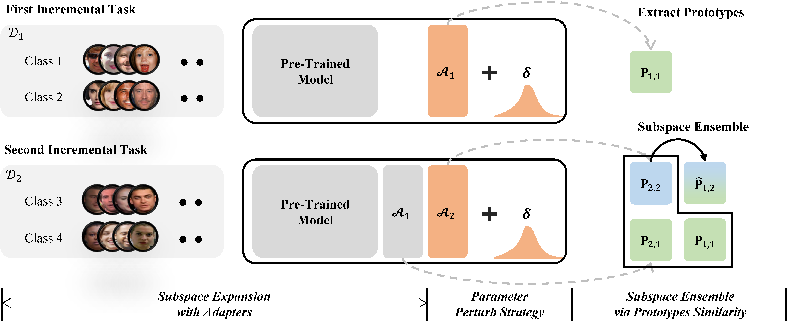
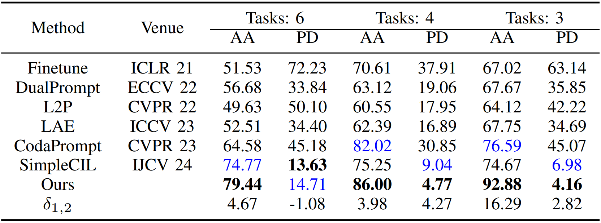

# Perturbation-based Expandable Subspace Ensemble for Class Incremental Face Forgery Detection



The rapid development of face forgery generation technologies has made it easier to create increasingly realistic forged faces, posing significant threats to societal security. While existing detection methods perform well on known forgery techniques, they struggle to adapt to emerging forgeries. Efforts to address this challenge have focused on enhancing generalization or using adapter-based incremental learning. However, generalization methods fail to update model parameters with new forgeries, and adapter-based approaches face issues such as overfitting and biased distributions.
To address these limitations, we model face forgery detection as a class incremental learning problem and introduce a new approach, Perturbation-based Expandable Subspace Ensemble (PESE) for Class Incremental Face Forgery Detection. PESE integrates three key components: subspace expansion, parameter perturbation, and subspace ensemble. These components work together to balance model stability and plasticity by expanding subspaces to capture task-specific knowledge, applying parameter perturbation to avoid overfitting, and integrating subspaces to address scale differences and representation misalignments. Additionally, we introduce a new class-incremental face forgery detection dataset, CIL-forgery, to support the evaluation of incremental learning methods. Extensive experiments conducted on this dataset demonstrate the effectiveness of our PESE method in overcoming the challenges posed by emerging face forgery techniques, demonstrating its robustness in adapting to new forgeries while maintaining strong performance on previously learned tasks.


## 🎊 Results

We compared the performance of six advanced methods under three different settings to verify the competitive performance of PESE.



## Requirements
### 🗂️ Environment
1. [torch 2.4.0](https://github.com/pytorch/pytorch)
2. [torchvision 0.19.0](https://github.com/pytorch/vision)
3. [timm 0.6.12](https://github.com/huggingface/pytorch-image-models)
4. [easydict](https://github.com/makinacorpus/easydict)

### 🔎 Dataset

Traditional face forgery detection benchmark datasets typically consist of only two classes: real and forged face images, making them unsuitable for class-incremental face forgery detection. To address this gap, we introduce **CIL-Forgery**, a new benchmark constructed from four classic datasets: [Faceforensics++](https://github.com/ondyari/FaceForensics), [DeepfakeDetection](https://github.com/ondyari/FaceForensics), [Celeb-DF](https://github.com/yuezunli/celeb-deepfakeforensics), and [DFFD](https://cvlab.cse.msu.edu/dffd-dataset.html). Detailed information is provided in the table below. In the future, we will add more publicly available or self-constructed forged face data.

|      Dataset      | Number of real videos | Number of fake videos | Number of real images | Number of fake images |                        Forged method                        |
| :---------------: | :-------------------: | :-------------------: | :-------------------: | :-------------------: | :---------------------------------------------------------: |
|  Faceforensics++  |         1000          |         5000          |           -           |           -           | Deepfakes, Face2Face, FaceSwap, NeuralTextures, FaceShifter |
| DeepFakeDetection |          363          |         3068          |           -           |           -           |                             DFD                             |
|     Celeb-DF      |          590          |         5639          |           -           |           -           |                          Celeb-DF                           |
|       DFFD        |           -           |           -           |         58703         |        240336         |             PGGAN、 StyleGAN、StarGAN、FaceAPP              |

We first extract image frames, then use [RetinaFace](https://github.com/biubug6/Pytorch_Retinaface) to detect faces and resize them to $224\times 224$. For FF++, we take the first 270 frames for each training video, and the first 110 frames for each testing video. For DeepFakeDetection, we randomly select 50 frames from each video. For Celeb-DF, we sample 3 frames per second. The datasets were then divided into 12 classes based on different forgery techniques: Deepfakes, Face2Face, FaceSwap, NeuralTextures, FaceShifter, DFD, Celeb-DF, FaceAPP, PGGAN, StarGAN, StyleGAN, and Real Face. Notably, since each forgery dataset contains one real face and several forged faces, there is an imbalance in the number of real class samples versus forged class samples. To mitigate this issue, we combined the real images from the four forgery datasets to form a larger real class, i.e., Real Face, thus alleviating the data imbalance problem. The number of original real face images is as follows.

| Forged method  | Training set | Testing set |
| :------------: | :----------: | :---------: |
|   Deepfakes    |    194214    |    15400    |
|   Face2Face    |    194400    |    15400    |
|    FaceSwap    |    194399    |    15400    |
| NeuralTextures |    194399    |    15400    |
|  FaceShifter   |    194400    |    15400    |
|      DFD       |    109854    |    21416    |
|    Celeb-DF    |    201902    |    12984    |
|    FaceAPP     |     6309     |    4501     |
|     PGGAN      |    19957     |    17950    |
|    StarGAN     |    10000     |    21913    |
|    StyleGAN    |    19999     |    17997    |
|   Real Face    |    246671    |    35077    |

Finally, according to different forgery methods, we randomly sample 10,000 face images for the training set and 2,000 face images for the testing set, resulting in the **CIL-Forgery** dataset. For FaceAPP, the number of face images in the training set is fewer than 10,000, so we applied [data augmentation](data_process/dataAug.py) techniques (rotation, flipping, scaling, and cropping) to increase the number to 10,000. Detailed information about the **CIL-Forgery** dataset is as follows.

| Forged method  | Training set | Testing set |
| :------------: | :----------: | :---------: |
|   Deepfakes    |    10000     |    2000     |
|   Face2Face    |    10000     |    2000     |
|    FaceSwap    |    10000     |    2000     |
| NeuralTextures |    10000     |    2000     |
|  FaceShifter   |    10000     |    2000     |
|      DFD       |    10000     |    2000     |
|    Celeb-DF    |    10000     |    2000     |
|    FaceAPP     |    10000     |    2000     |
|     PGGAN      |    10000     |    2000     |
|    StarGAN     |    10000     |    2000     |
|    StyleGAN    |    10000     |    2000     |
|   Real Face    |    10000     |    2000     |


## 🔑 Running scripts

Please follow the settings in the `exps` folder to prepare json files, and then run:

```
python main.py --config ./exps/[filename].json
```

**Here is an example of how to run the code** 

if you want to run the CIL-Forgery dataset using Swin-B, you can follow the script: 
```
python main.py --config ./exps/pese.json
```

if you want to run the CIL-Forgery dataset using ViT-B/16-IN1K, you can follow the script: 
```
python main.py --config ./exps/pese_vit.json
```

if you want to run the CIL-Forgery dataset using ViT-B/16-IN21K, you can follow the script: 
```
python main.py --config ./exps/pese_vit_in21k.json
```

After running the code, you will get a log file in the `logs/pese/CIL_Forgery/` folder.

## 👨‍🏫 Acknowledgment

We would like to express our gratitude to the following repositories for offering valuable components and functions that contributed to our work.

- [PILOT: A Pre-Trained Model-Based Continual Learning Toolbox](https://github.com/sun-hailong/LAMDA-PILOT)
